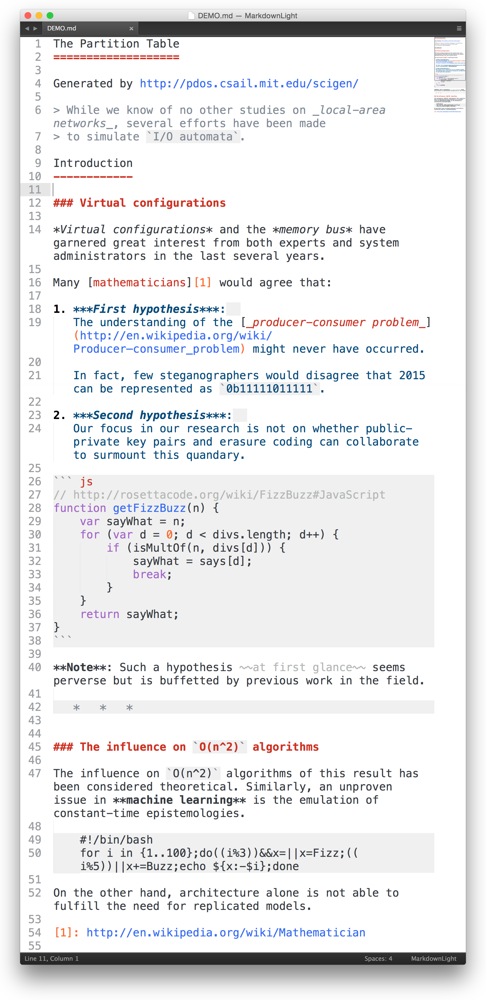
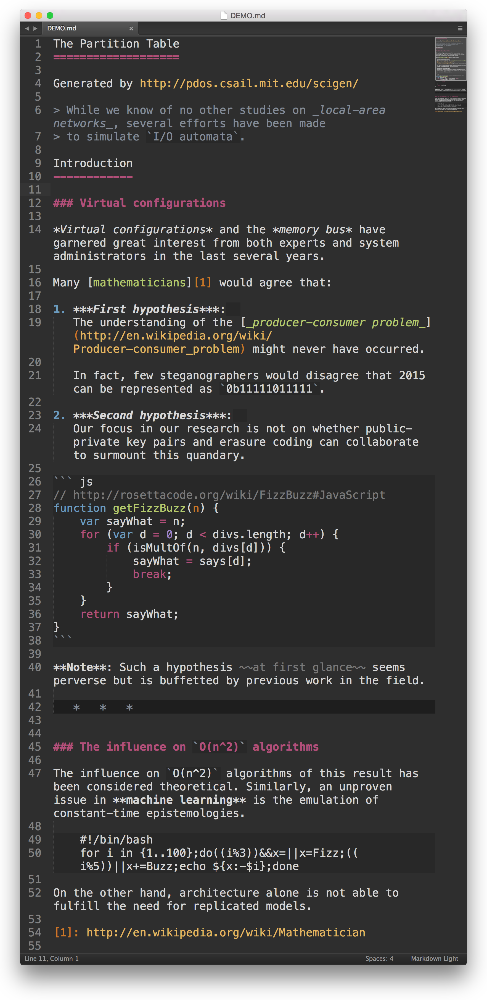

Markdown Light
==============

Markdown **syntax highlighting plugin** and **color scheme** for Sublime Text 3.

:skull: **WARNING! This project is pretty much abandoned. I personally don't use Sublime Text anymore and don't have time to fix compatibility issues with new versions of Siblime that continue to arise.**

[](https://travis-ci.org/sekogan/MarkdownLight)

Features
--------

- Supports core Markdown with Github additions.
- Self-contained, everything just works out of the box.
- Has built-in light and dark color schemes with normal contrast.
- Focused on real use cases, not specs.
- Covered by unit tests to control corner cases and regressions.

Installation
------------

Install via **Package Control** or just clone the repository to the Sublime *"Packages"* directory.

Demo
----

Light color scheme (default)



Dark color scheme



How to use the dark color scheme
--------------------------------

Open any markdown file and use the main menu to edit syntax specific settings (`Settings — More` &rarr; `Syntax Specific — User`). Add `color_scheme` value as follows:

```json
{
	"color_scheme": "Packages/MarkdownLight/MarkdownDark.tmTheme"
}
```

Running the tests
-----------------

[UnitTesting][] plugin is required to run the tests. Use it as described [here][UnitTestingReadme].

[UnitTesting]: https://github.com/randy3k/UnitTesting
[UnitTestingReadme]: https://github.com/randy3k/UnitTesting-example/blob/master/README.md

---

Copyright &copy; 2015 Sergey Kogan.
Licensed under [The MIT license](LICENSE).

